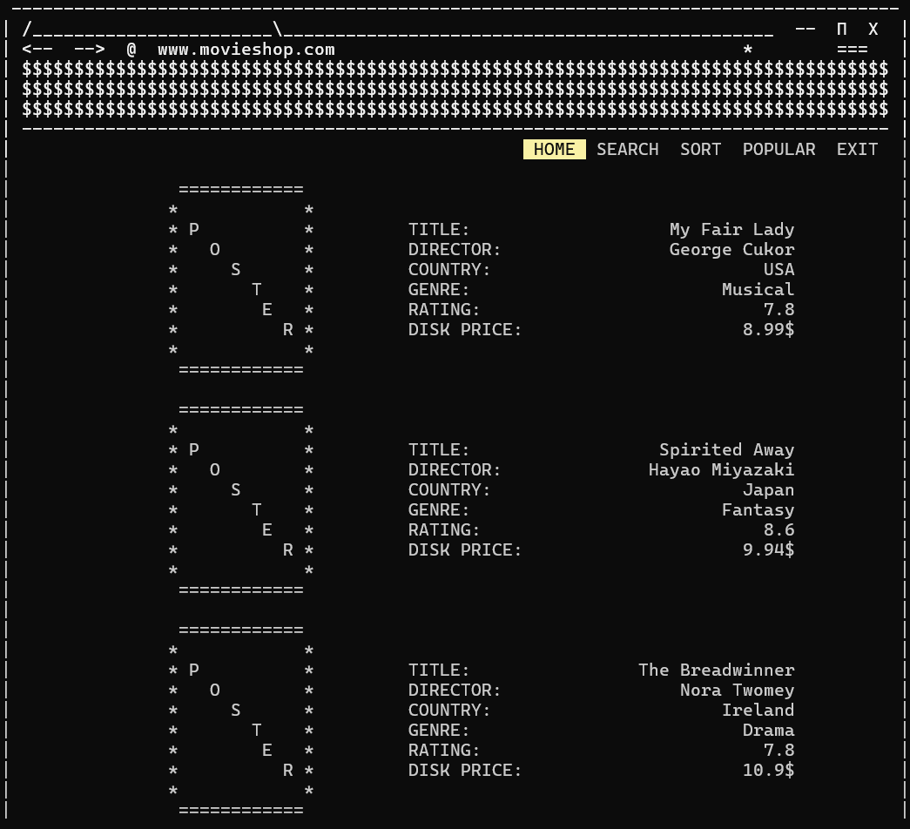
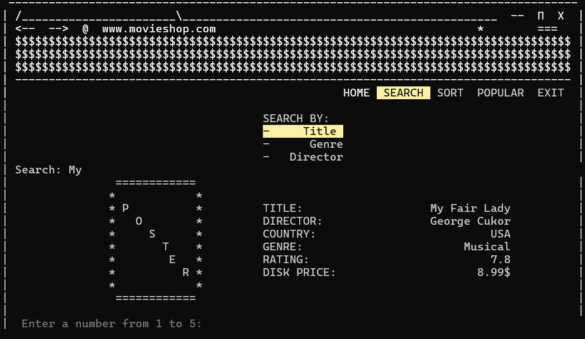
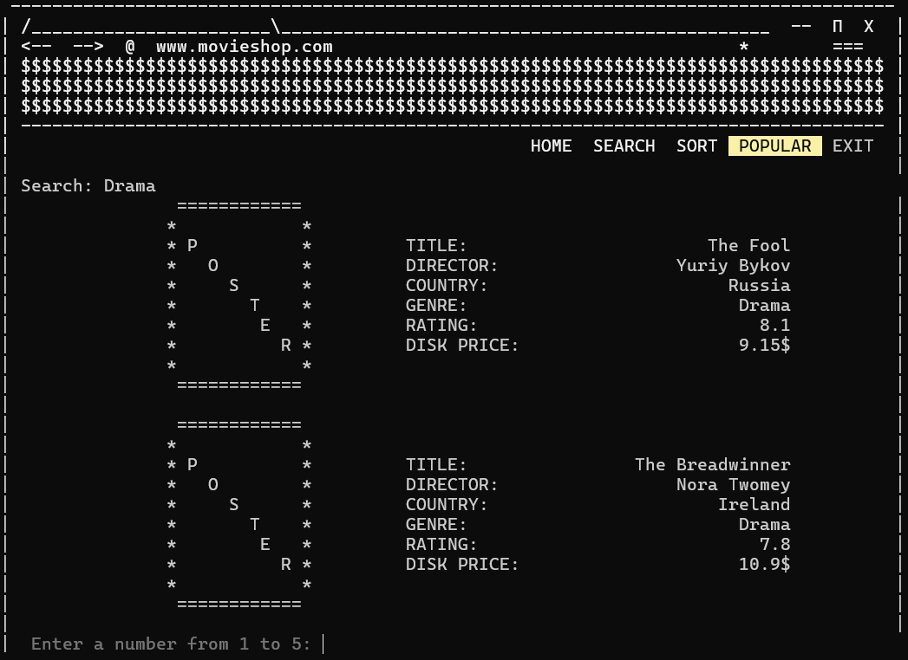
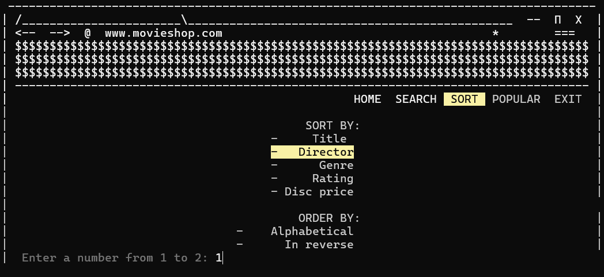
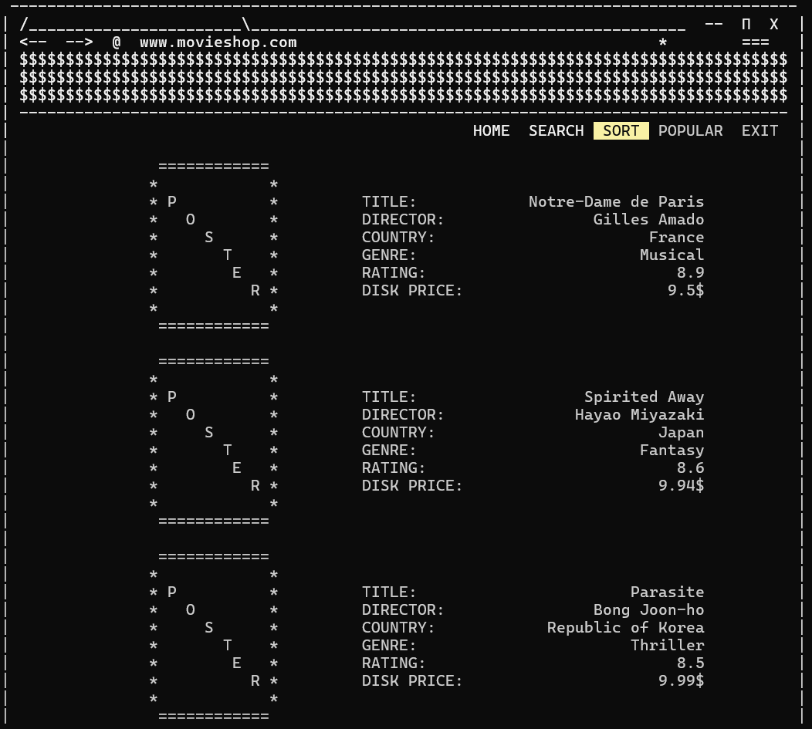

# 🎬 MovieShop

**MovieShop** is a personal pet project — a simple console-based movie disc shop application written in **C/C++**.  
The program allows users to **search**, **sort**, and **view** movies with details such as title, director, genre, rating, and disk price.  
It features a retro **ASCII art interface** for a fun visual experience in the terminal.

---

## 📸 Screenshots

You can see how the interface looks below:

  

  
  
  

---

## 💾 Download

👉 [Download MovieShop.exe](https://github.com/tattianDrag64/Movie_Shop/blob/main/movie-shop.exe)

---

## 🧰 Features

### 🏠 Home
- View all available movies in the collection.

### 🔍 Search
- Search by:
  - **Title**
  - **Genre**
  - **Director**

### 🗂️ Sort
- Sort movies by:
  - **Title**
  - **Director**
  - **Genre**
  - **Rating**
  - **Disk Price**
- Sorting options:
  - Alphabetical (A → Z)
  - Reverse order (Z → A)

### 🌟 Popular
- Navigate to a list of popular movies (predefined).

### ❌ Exit
- Exit the application safely.

---

## 🎭 Supported Genres

- Musical  
- Fantasy  
- Drama  
- Comedy  
- Action  
- Thriller  
- Horror  
- Animation  
- Documentary  
*...and more*

---

## 🖥 Technologies Used

- C++
- OOP principles
- ASCII graphics for console interface

---

## 📁 File Structure

- `movieshop.cpp` – Main loop and program flow
- `movieshop.h / movie-shop.cpp` – Class for movie entity
- `data.txt` – Movie data storage

---

## 🚀 How to Run

1. Download the `.exe` file from the [link above](#💾-download).
2. Launch the file in terminal or by double-clicking.
3. Use number input (1 to 5) to navigate through the menu.

---

## 👩‍💻 About the Project

This project was created as part of my personal learning journey.  
It helped me improve my C++ skills and explore how to build interactive console applications.

Feel free to fork or suggest improvements!

---

**Made with ❤️ as a pet project**
